# Architecture Diagrams Reference

Complete syntax reference and advanced patterns for architecture visualization.

---

## Mermaid Flowchart Reference

### Node Shapes

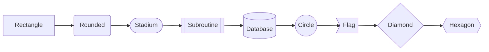

| Shape | Syntax | Use Case |
|-------|--------|----------|
| Rectangle | `[text]` | Services, components |
| Rounded | `(text)` | Processes, actions |
| Stadium | `([text])` | Start/end points |
| Subroutine | `[[text]]` | External calls |
| Database | `[(text)]` | Data stores |
| Circle | `((text))` | Events, triggers |
| Diamond | `{text}` | Decisions |
| Hexagon | `{{text}}` | Preparation steps |

### Arrow Types

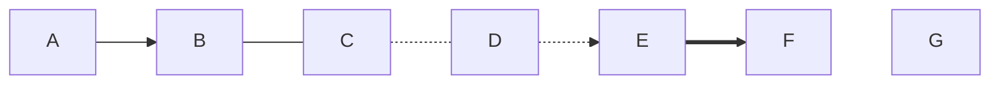

| Arrow | Syntax | Meaning |
|-------|--------|---------|
| Solid | `-->` | Direct call/dependency |
| Open | `---` | Association (no direction) |
| Dotted | `-.-` | Optional/async association |
| Dotted arrow | `-.->` | Async call |
| Thick | `==>` | Primary/critical path |
| Invisible | `~~~` | Layout spacing |

### Subgraphs

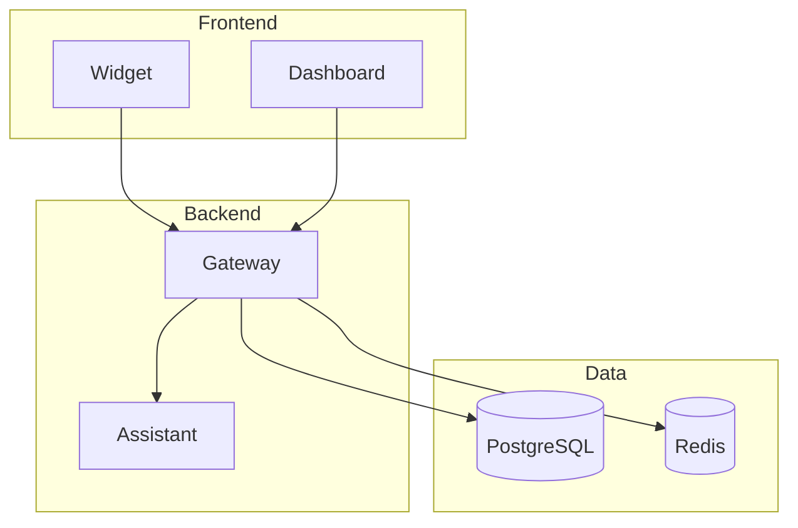

### Styling

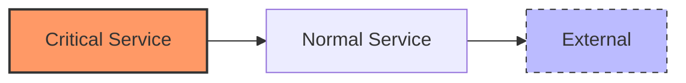

## Sequence Diagram Reference

### Message Types

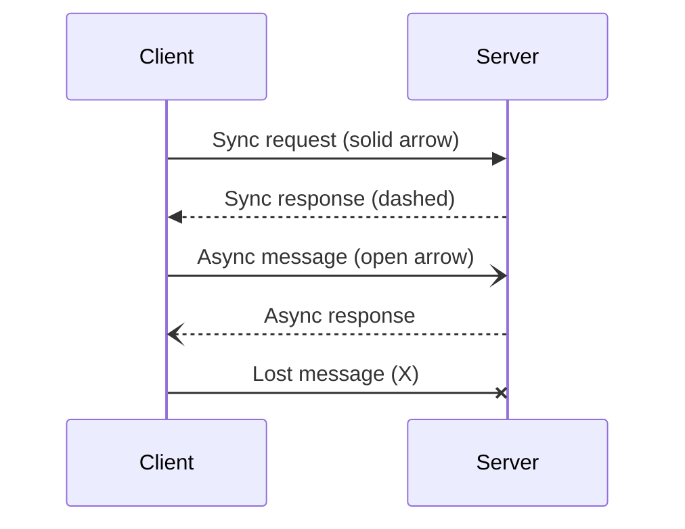

| Syntax | Type | Use Case |
|--------|------|----------|
| `->>` | Solid arrow | Synchronous request |
| `-->>` | Dashed arrow | Response or async |
| `-)` | Open arrow | Fire-and-forget |
| `--)` | Open dashed | Async notification |
| `-x` | X arrow | Failed/lost message |

### Control Flow

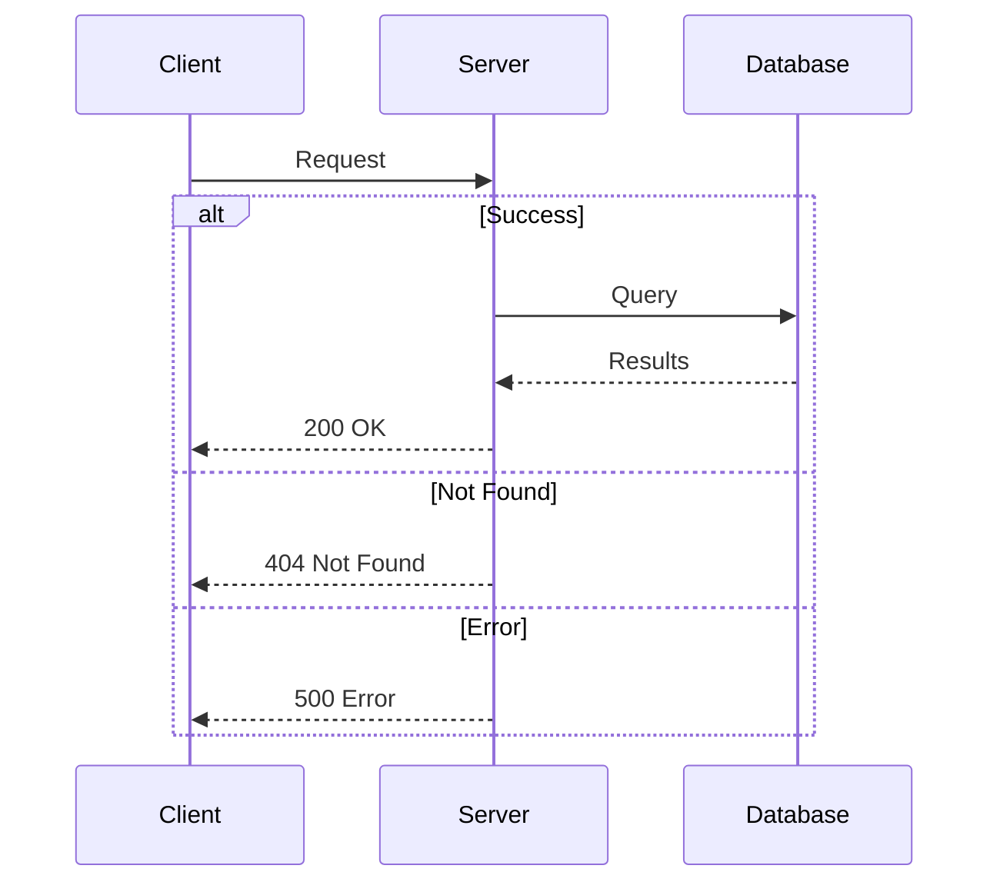

> **Important**: The keyword `end` must match the case used to open the block. Using lowercase `end` elsewhere in diagram text can cause parsing errors.

### Loops and Parallel

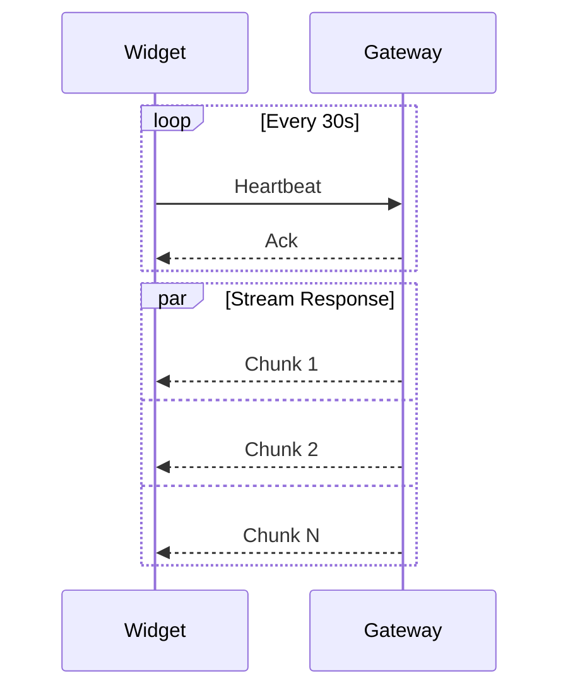

### Notes and Activations

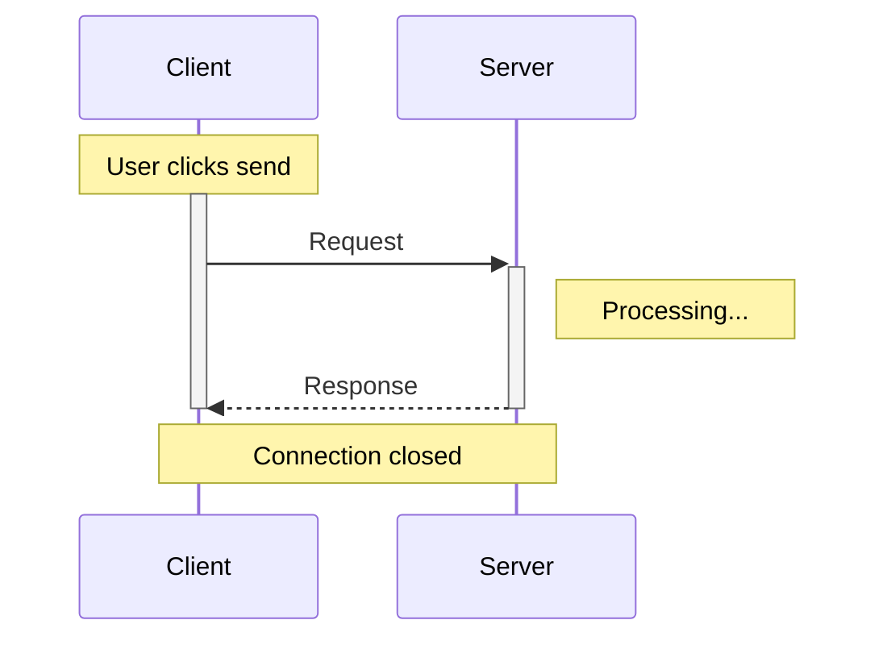

## C4 Model Reference

> **Note**: C4 diagrams in Mermaid are experimental. Syntax may change in future releases. Refer to the [official Mermaid C4 documentation](https://mermaid.js.org/syntax/c4.html) for the latest syntax.

### C4 Context (Level 1)

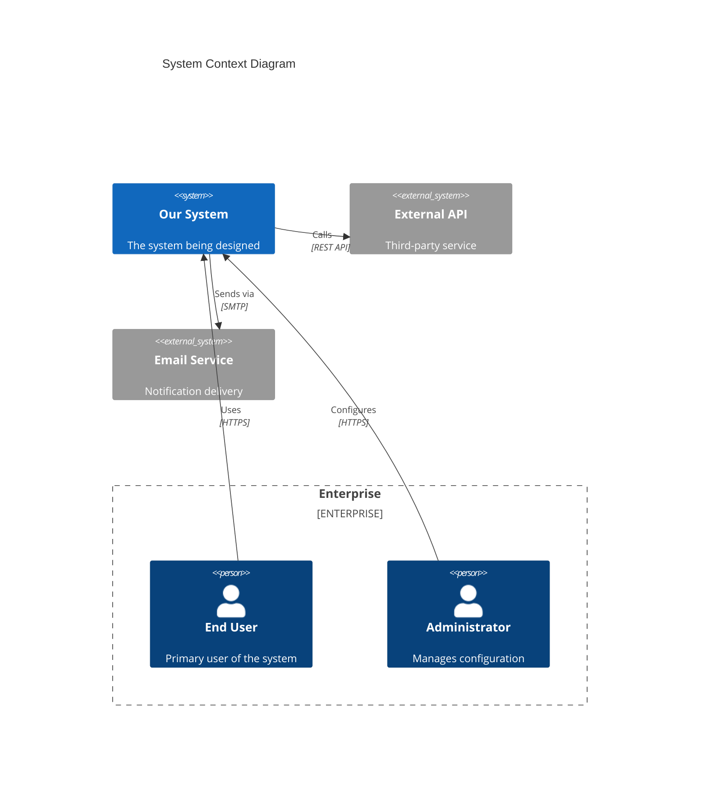

### C4 Container (Level 2)

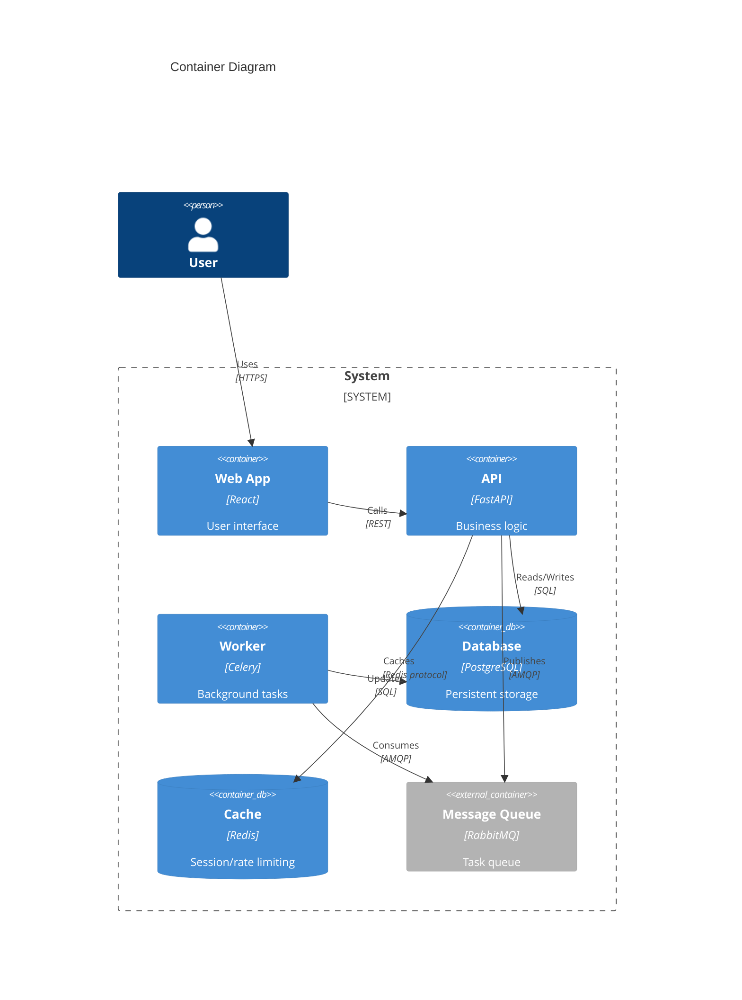

### C4 Component (Level 3)

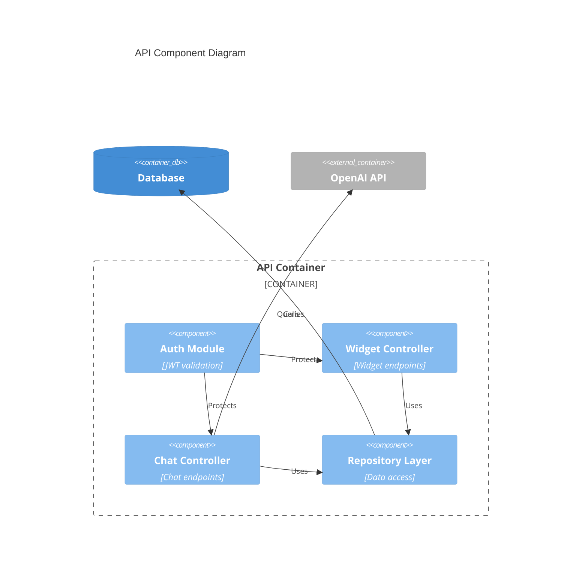

## ASCII Diagram Patterns

### Service Architecture

```
                           ┌─────────────────────────────────────────┐
                           │              LOAD BALANCER              │
                           └──────────────────┬──────────────────────┘
                                              │
              ┌───────────────────────────────┼───────────────────────────────┐
              │                               │                               │
              ▼                               ▼                               ▼
    ┌─────────────────┐             ┌─────────────────┐             ┌─────────────────┐
    │   Instance 1    │             │   Instance 2    │             │   Instance 3    │
    │   (Gateway)     │             │   (Gateway)     │             │   (Gateway)     │
    └────────┬────────┘             └────────┬────────┘             └────────┬────────┘
             │                               │                               │
             └───────────────────────────────┼───────────────────────────────┘
                                             │
                           ┌─────────────────┴─────────────────┐
                           │                                   │
                           ▼                                   ▼
                 ┌─────────────────┐                 ┌─────────────────┐
                 │   PostgreSQL    │                 │     Redis       │
                 │   (Primary)     │                 │   (Cluster)     │
                 └─────────────────┘                 └─────────────────┘
```

### Request Flow

```
┌──────────┐    ┌──────────┐    ┌──────────┐    ┌──────────┐    ┌──────────┐
│  Client  │───▶│  Widget  │───▶│ Gateway  │───▶│Assistant │───▶│  OpenAI  │
└──────────┘    └──────────┘    └──────────┘    └──────────┘    └──────────┘
     │               │               │               │               │
     │   Load Page   │               │               │               │
     │──────────────▶│               │               │               │
     │               │  WS Connect   │               │               │
     │               │──────────────▶│               │               │
     │               │               │   HTTP POST   │               │
     │               │               │──────────────▶│               │
     │               │               │               │  API Call     │
     │               │               │               │──────────────▶│
     │               │               │               │◀──────────────│
     │               │               │◀──────────────│   SSE Stream  │
     │               │◀──────────────│   WS Frames   │               │
     │◀──────────────│   Display     │               │               │
     │               │               │               │               │
```

### Decision Tree

```
                         ┌─────────────────────┐
                         │  Need Real-time?    │
                         └──────────┬──────────┘
                                    │
                    ┌───────────────┴───────────────┐
                    │ Yes                       No  │
                    ▼                               ▼
          ┌─────────────────┐             ┌─────────────────┐
          │ Browser Support │             │   REST API      │
          │   Required?     │             │   (Polling OK)  │
          └────────┬────────┘             └─────────────────┘
                   │
       ┌───────────┴───────────┐
       │ Modern            All │
       ▼                       ▼
┌─────────────────┐   ┌─────────────────┐
│   WebSocket     │   │      SSE        │
│ (Bidirectional) │   │ (Server Push)   │
└─────────────────┘   └─────────────────┘
```

## Best Practices

### Diagram Maintenance

1. **Keep diagrams close to code** - Store in same repo
2. **Version with architecture** - Update when system changes
3. **Use consistent notation** - Same shapes mean same things
4. **Include timestamps** - Note when last updated

### Readability

1. **Limit nodes** - Max 7-10 per diagram, split if needed
2. **Use consistent direction** - TD for hierarchy, LR for flows
3. **Group related items** - Subgraphs for logical boundaries
4. **Label all connections** - Protocol, format, or action

### Documentation

1. **Add context** - What decision does this support?
2. **Link to ADRs** - Reference architectural decisions
3. **Include legends** - Define abbreviations and symbols
4. **Note assumptions** - What's simplified or omitted?
